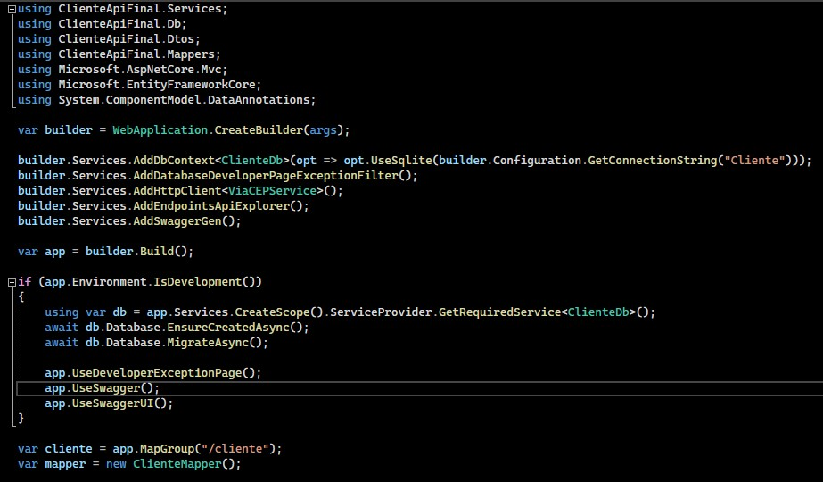

# API Muralis - Desafio

_Criação de uma API para realizar o cadastramento, consulta, exclusão, alteração, pesquisa e listagem de clientes._

## Arquitetura do projeto


## Explicando as classes do projeto

### ClienteDb


Nessa classe, foi criado as tabelas do banco de dados, junto ao método `OnModelCreating`, responsável por configurar o modelo de dados antes dele ser usado para criar o banco de dados. 

Como parâmetro, foi utilizado o objeto `ModelBuilder` para configurar as propriedades e outras características da entidade Cliente.

* `OwnsOne` armazena as informações do endereço como uma coluna de propriedade única na tabela de Clientes ao invés de em uma tabela separada

* `HasMany` foi usado para configurar que um Cliente pode ter vários contatos e de forma inversa, o `WithOne` significa que um contato só pode pertencer a um Cliente.


### DTOs


Usado para transferir dados entre camadas de uma aplicação. 
Nas classes DTOs foram implementados os mesmos campos pertencentes as classes de models. Foi adicionado a alguns campos as propriedades `Required`. Para a propriedade Cep, foi adicionado uma `RegularExpression` 

```
@"^\d{5}[-]{0,1}\d{3}$" 
```
Verifica se a string começa com exatamente 5 dígitos, seguidos opcionalmente por um hífen, e terminado com exatamente 3 dígitos. O caractere de circunflexo (^) indica o início da string, e o caractere de dólar ($) indica o final da string.

### Mappers


* `[Mapper(EnumMappingStrategy = EnumMappingStrategy.ByName)]` indica a estratégia de mapeamento de enumerações a ser usada em uma biblioteca de mapeamento automático. 

* `[MapProperty(nameof(EnderecoCep.Localidade),nameof(EnderecoDTO.Cidade))]` mapeia a cidade com a localidade, pois ambas possuem nomes de propriedades diferentes

### Models


* `[DatabaseGenerated(DatabaseGeneratedOption.Identity)]` indica que a entidade deve ser gerada automaticamente pelo banco de dados como uma chave primária auto-incrementante.

### EnderecoCep e ViaCEPService


* `EnsureSuccessStatusCode` usado para verificar se uma resposta HTTP retornou com sucesso 

* `ReadAsStringAsync` usado para ler o conteúdo de uma resposta HTTP como uma string.

### Program



* `WebApplication.CreateBuilder(args);` cria um objeto que é usado para configurar e construir um aplicativo web host. 

* `Services.AddDbContext` usado para adicionar uma implementação do DbContext ao sistema de injeção de dependência (DI).

* `UseSqlite` usado para configurar o uso do provedor de banco de dados SQLite

* `GetConnectionString` usado para obter uma string de conexão de um arquivo de configuração
